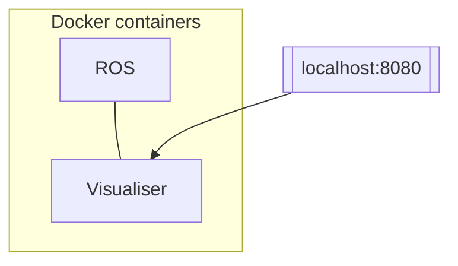

# eufs_sim

[eufs_sim](https://gitlab.com/eufs/eufs_sim) is an open source Formula Student autonomous vehicle simulation from Edinburgh University.

## Installation

### Requirements

- [docker](https://www.docker.com/)

> [!IMPORTANT]  
> If you get an error related to permissions when using any `docker` commands, you will need to prefix all them with `sudo`.
> Read [here](https://docs.docker.com/engine/install/linux-postinstall/#manage-docker-as-a-non-root-user) for more information and instructions on how to avoid it.
> In short, you will need to run the following commands:
>
> ```bash
> # Create the docker group
> sudo groupadd docker
> # Add your user to the docker group
> sudo usermod -aG docker $USER
> ```
>
> and then log out and log back in so that your group membership is re-evaluated.

### Steps

To launch the environment, run the following command:

```bash
# Host machine
docker compose up
```

The first time it will take a while to configure everything.
Subsequent launches will be much quicker.  
While the docker containers are running, you will be able to access the GUI by opening your browser and visiting [http://localhost:8080/vnc.html](http://localhost:8080/vnc.html).
After clicking **Connect** you should see the desktop of the docker container running ROS.



> [!NOTE]  
> If at any moment you want to clean the slate and start from scratch, run
> ```bash
> docker compose down --volumes
> ```

## Working with the Docker container

While the containers are running, you can attach a shell to the ROS container `eufs_sim_ros`.
You can either do it from the terminal or use [VsCode](https://code.visualstudio.com/) with the [Dev containers](https://marketplace.visualstudio.com/items?itemName=ms-vscode-remote.remote-containers) plugin installed or similar IDEs.

### From terminal

```bash
# Host machine
docker exec -it eufs_sim_ros /bin/bash
```

## Launching the simulator

To launch the simulation, run 

```bash
# ROS container
ros2 launch eufs_launcher eufs_launcher.launch.py
```

You should see a small window appear in the browser.
Make it bigger, deselect `RViz` and select `Gazebo UI`, then `Launch!`.
Two new windows should appear: the simulator, **Gazebo**, and a manual controller you can use to move the car in the simulation.  
Click on `Manual drive` and test the controls!
