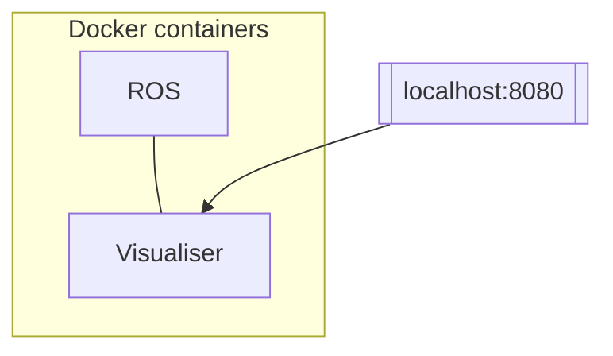
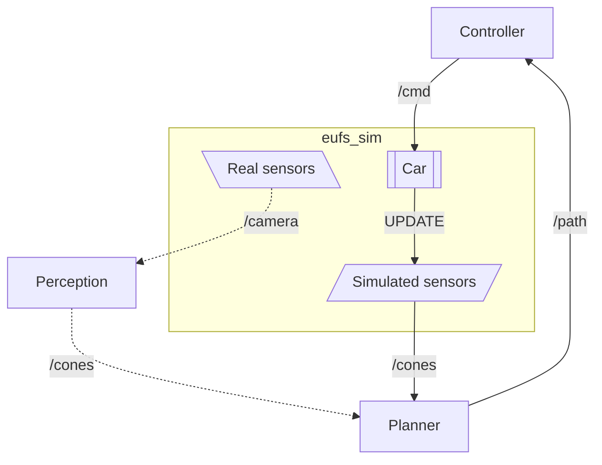

# eufs_sim

[eufs_sim](https://gitlab.com/eufs/eufs_sim) is an open source Formula Student autonomous vehicle simulation from Edinburgh University.

## Installation

### Requirements

- [docker](https://www.docker.com/)

> [!IMPORTANT]  
> If you get an error related to permissions when using any `docker` commands, you will need to prefix all them with `sudo`.
> Read [here](https://docs.docker.com/engine/install/linux-postinstall/#manage-docker-as-a-non-root-user) for more information and instructions on how to avoid it.
> In short, you will need to run the following commands:
>
> ```bash
> # Create the docker group
> sudo groupadd docker
> # Add your user to the docker group
> sudo usermod -aG docker $USER
> ```
>
> and then log out and log back in so that your group membership is re-evaluated.

### Steps

To launch the environment, run the following command:

```bash
# Host machine
docker compose up
```

The first time it will take a while to configure everything.
Subsequent launches will be much quicker.  
While the docker containers are running, you will be able to access the GUI by opening your browser and visiting [http://localhost:8080/vnc.html](http://localhost:8080/vnc.html).
After clicking **Connect** you should see the desktop of the docker container running ROS.



> [!NOTE]  
> If at any moment you want to clean the slate and start from scratch, run
>
> ```bash
> docker compose down --volumes
> ```

## Working with the Docker container

While the containers are running, you can attach a shell to the ROS container `eufs_sim_ros`.
You can either do it from the terminal or use [VsCode](https://code.visualstudio.com/) with the [Dev containers](https://marketplace.visualstudio.com/items?itemName=ms-vscode-remote.remote-containers) plugin installed or similar IDEs.

### From terminal

```bash
# Host machine
docker exec -it eufs_sim_ros /bin/bash
```

## Architecture



### Nodes

The ROS nodes, the rectangles in the diagram above, mimic the team division of the Newcastle Racing AI team:

- **Perception**: receives the camera feed and other sensors to determines the cone information
- **Planner**: receives the cone information to calculates the path to follow
- **Controller**: receives the path to follow and sends commands to the car

### Topics

- `/camera` of type ??: camera feed from the car. Sent by the Sensors to the **Perception** node (NOT CURRENTLY IMPLEMENTED IN THE GAZEBO SIMULATOR)
- `/cones` of type [ConeArrayWithCovariance](https://gitlab.com/eufs/eufs_msgs/-/blob/master/msg/ConeArrayWithCovariance.msg): cones detected by the **Perception** node. Sent to the **Planner** node
- `/path` of type [PoseArray](https://docs.ros.org/en/noetic/api/geometry_msgs/html/msg/PoseArray.html): list of waypoints calculated by the **Planner** node. Sent to the **Controller** node
- `/cmd` of type [AckermannDriveStamped](https://docs.ros.org/en/noetic/api/ackermann_msgs/html/msg/AckermannDriveStamped.html): command to move the car. Sent from the **Controller** node to the underlying car motor

## Launching the simulator

To launch the simulation, run

```bash
# ROS container
. /opt/ros/galactic/setup.sh && colcon build --packages-select newcastle_racing_ai newcastle_racing_ai_msgs && . install/local_setup.sh && ros2 launch newcastle_racing_ai nra_launch.py
```

You should see a small window appear in the browser.
Make it bigger, deselect `RViz` and select `Gazebo UI`, then `Launch!`.
Two new windows should appear: the simulator, **Gazebo**, and a manual controller you can use to move the car in the simulation.  
Click on `Manual drive` and test the controls!

### Real sensors

> [!WARNING]  
> NOT CURRENTLY IMPLEMENTED IN THE GAZEBO SIMULATOR

### Simulated sensors

When the simulation is running, the simulated sensors will send the cone information using the `/cones` topic.
You can visualise the messages by running

```bash
# ROS container
ros2 topic echo /cones
```

The information can be used to calculate the path to follow, which will be in turn sent to the controller in the `/path` topic.

## Useful commands

```bash
# Build all packages in the workspace
colcon build
# Build a specific package
colcon build --packages-select <package_name>
# Source the current workspace
source install/setup.bash
# Check the available nodes
ros2 node list
# Check the available topics
ros2 topic list
# Visualise the messages in a topic
ros2 topic echo <topic_name>
# Get information about a topic
ros2 topic info <topic_name>
# Send a message to a topic
ros2 topic pub <topic_name> <message_type> <message>
# e.g. 
# ros2 topic pub /cmd_ackermann ackermann_msgs/msg/AckermannDriveStamped "{steering_angle: 0.0, steering_angle_velocity: 0.0, speed: 0.0, acceleration: 0.0, jerk: 0.0}"
```
