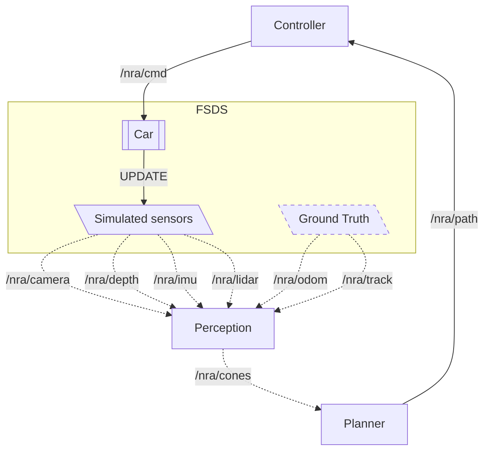

# Newcastle Racing AI

Repository containing the code for the Newcastle Racing AI team.
It contains the ROS nodes to control the car and the docker environment to run
the simulation.

## TL;DR


## Installation

### Requirements

- [docker](https://www.docker.com/)
- [Formula Student Driverless Simulator](https://fs-driverless.github.io/Formula-Student-Driverless-Simulator/v2.2.0/)

> [!IMPORTANT]  
> If you get an error related to permissions when using any `docker` commands,
> you will need to prefix all of them with `sudo`.
> Read
> [docs](https://docs.docker.com/engine/install/linux-postinstall/#manage-docker-as-a-non-root-user)
> for more information and instructions on how to avoid it.
> In short, you will need to run the following commands:
>
> ```bash
> # Create the docker group
> sudo groupadd docker
> # Add your user to the docker group
> sudo usermod -aG docker $USER
> ```
>
> Log out and log back in afterwards, so that your group membership is re-evaluated.

### Installing the simulator

We are using our fork of the [Formula Student Driverless Simulator](https://fs-driverless.github.io/Formula-Student-Driverless-Simulator/v2.2.0/).
Go to the [release page](https://github.com/FS-Driverless/Formula-Student-Driverless-Simulator/releases) and download the latest release for [linux](https://github.com/FS-Driverless/Formula-Student-Driverless-Simulator/releases/download/v2.2.0/fsds-v2.2.0-linux.zip) (tested) or [windows](https://github.com/FS-Driverless/Formula-Student-Driverless-Simulator/releases/download/v2.2.0/fsds-v2.2.0-windows.zip) (not tested).

### Running the simulator

Unzip it and run either the `FSDS.exe` on Windows or `FSDS.sh` on Linux.
You can customize the simulator by editing the `settings.json` file in the root folder.

### Running the docker environment

To launch the environment, run the following command:

```bash
# Host machine
docker compose up
```

The first time it will take a while to configure everything.
Subsequent launches will be much quicker.

> [!NOTE]  
> If at any moment you want to clean the slate and start from scratch, run
>
> ```bash
> docker compose down --volumes
> ```

Some parameters can be configured in the `docker-compose.yml` file, such as the
simulation timestep.

## Working with the Docker container

While the containers are running, you can attach a shell to the ROS container
`newcastle-racing-ai`. You can either do it from the terminal or use
[VSCode](https://code.visualstudio.com/) with the [Dev
containers](https://marketplace.visualstudio.com/items?itemName=ms-vscode-remote.remote-containers)
plugin installed or similar IDEs.

### From the terminal

```bash
# Host machine
docker exec -it newcastle-racing-ai /bin/bash
```

## Architecture



> [!NOTE]  
> The _Simulated sensor_ will eventually be replaced by real sensors on the car.

> [!NOTE]  
> The _Ground Truth_ is used for testing, but it will not be available on the real car.

### Nodes

The ROS nodes, the rectangles in the diagram above, mimic the team division of
the Newcastle Racing AI team:

- **Perception**: receives the camera feed and other sensors to determines the
  cone information
- **Planner**: receives the cone information to calculates the path to follow
- **Controller**: receives the path to follow and sends commands to the car

### Topics

| Topic Name    | Type                                                                                                           | From           | To             | Description                                                   |
| ------------- | -------------------------------------------------------------------------------------------------------------- | -------------- | -------------- | ------------------------------------------------------------- |
| `/nra/camera` | [Image](https://docs.ros.org/en/noetic/api/sensor_msgs/html/msg/Image.html)                                    | _Sensors_      | **Perception** | Camera feed from the car (optional)                           |
| `/nra/depth`  | [Image](https://docs.ros.org/en/noetic/api/sensor_msgs/html/msg/Image.html)                                    | _Sensors_      | **Perception** | Depth image from the camera feed                              |
| `/nra/imu`    | [Imu](https://docs.ros.org/en/noetic/api/sensor_msgs/html/msg/Imu.html)                                        | _Sensors_      | **Perception** | IMU data (orientation, angular velocity, linear acceleration) |
| `/nra/lidar`  | [PointCloud2](https://docs.ros.org/en/noetic/api/sensor_msgs/html/msg/PointCloud2.html)                        | _Sensors_      | **Perception** | Lidar points                                                  |
| `/nra/odom`   | [Odometry](https://docs.ros.org/en/noetic/api/nav_msgs/html/msg/Odometry.html)                                 | _Ground Truth_ | **Perception** | Odometry information                                          |
| `/nra/track`  | [Track](https://docs.ros.org/en/noetic/api/eufs_msgs/html/msg/Track.html)                                      | _Ground Truth_ | **Perception** | Track information                                             |
| `/nra/cones`  | [ConeArrayWithCovariance](https://gitlab.com/eufs/eufs_msgs/-/blob/master/msg/ConeArrayWithCovariance.msg)     | **Perception** | **Planner**    | Cones as detected by the **Perception** node                  |
| `/nra/path`   | [PoseArray](https://docs.ros.org/en/noetic/api/geometry_msgs/html/msg/PoseArray.html)                          | **Planner**    | **Controller** | List of waypoints calculated by the **Planner** node          |
| `/nra/cmd`    | [AckermannDriveStamped](https://docs.ros.org/en/noetic/api/ackermann_msgs/html/msg/AckermannDriveStamped.html) | **Controller** | _Car_          | Command to move the car                                       |

## Restarting the ROS nodes

By default, the ROS nodes will be launched automatically when the container
starts. If you want to make changes, stop the container, apply the changes to the nodes in the `newcastle_racing_ai` folder and then restart the container.

The manual process is shown in [entrypoint.sh](./newcastle_racing_ai/entrypoint.sh).

### Simulated sensors

When the simulation is running, the simulated sensors will send the cone
information using the `/nra/camera`, `nra/imu` and `nra/lidar` topics.

You can check the information being sent by using the `ros2 topic echo`
command, for example:

```bash
# Check the camera feed
ros2 topic echo /nra/camera
# Check the IMU data
ros2 topic echo /nra/imu
# Check the lidar points
ros2 topic echo /nra/lidar
```

Furthermore, for debugging purposes, the **Perception** node will also store the images it receives in the `newcastle_racing_ai/imgs` folder.

## Useful commands

```bash
# Build all packages in the workspace
colcon build
# Build a specific package
colcon build --packages-select <package_name>
# Source the current workspace
source install/setup.bash
# Check the available nodes
ros2 node list
# Check the available topics
ros2 topic list
# Visualise the messages in a topic
ros2 topic echo <topic_name>
# Get information about a topic
ros2 topic info <topic_name>
# Send a message to a topic
ros2 topic pub <topic_name> <message_type> <message>
# e.g.
# ros2 topic pub /cmd_ackermann \
#   ackermann_msgs/msg/AckermannDriveStamped \
#   "{ steering_angle: 0.0,
#      steering_angle_velocity: 0.0,
#      speed: 0.0,
#      acceleration: 0.0,
#      jerk: 0.0}"
```
